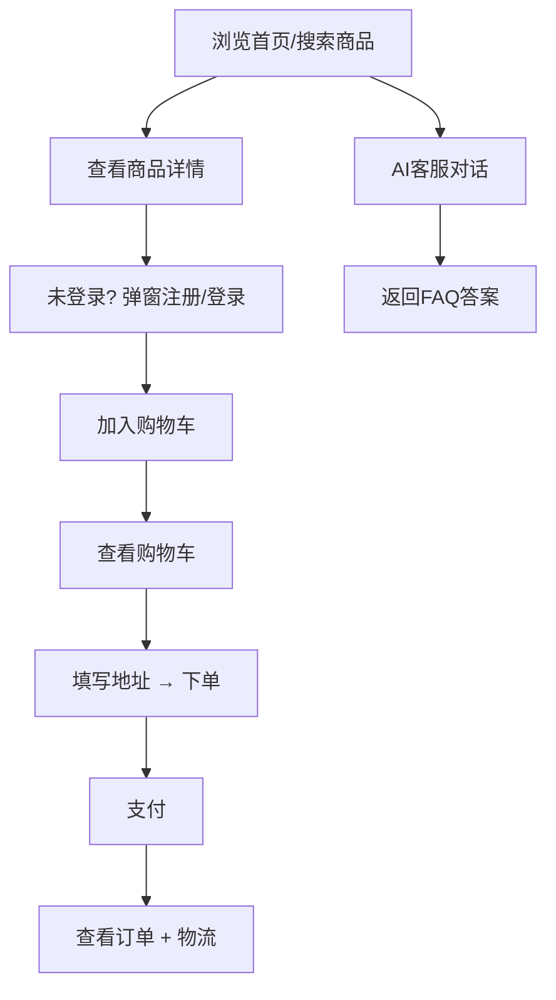

## 1. 产品概述

为智居电商平台（shop-service）搭建轻量级前端界面，让用户通过浏览器完成注册登录、商品浏览、购物车、下单支付、物流查看等完整购物流程，并集成 RAG 智能客服对话功能。

- 目标用户：C端消费者
- 核心价值：让后端 API 可见可操作，团队演示时无需 curl/Postman

## 2. 核心功能

### 2.1 用户角色

| 角色 | 登录方式 | 权限 |
|------|---------|------|
| 普通用户 | 邮箱注册 | 浏览、搜索、购物车、下单、支付、查物流、售后、AI客服 |
| 管理员 | 预置账号登录 | 同上 + 商品管理（发布/编辑/上下架）|

### 2.2 功能模块

1. **顶部导航栏**：Logo、搜索框、购物车图标(含数量角标)、登录/用户头像
2. **商品首页**：热门商品卡片、分类标签筛选、商品搜索
3. **商品详情**：大图、名称、价格、描述、库存、加入购物车
4. **购物车弹窗**：商品列表、数量调整、合计金额、去下单
5. **我的订单**：订单列表（状态筛选）、订单详情、支付/取消操作
6. **AI客服**：聊天窗口，输入问题 → 调用 RAG API 返回回答

### 2.3 页面详情

| 页面 | 模块 | 描述 |
|------|------|------|
| 首页 | 热门商品 | 一行 4 张商品卡片，显示名称/价格/加入购物车按钮 |
| 首页 | 分类筛选 | 顶部横向标签，点击过滤商品列表 |
| 首页 | 搜索栏 | 输入关键词实时搜索 |
| 商品详情 | 商品信息 | 大图占位、名称、价格、库存、描述 |
| 购物车 | 购物车列表 | 商品名、单价、数量调整、小计、总计 |
| 我的订单 | 订单列表 | 订单号、金额、状态标签、操作按钮 |
| AI客服 | 对话窗口 | 聊天气泡、输入框、发送按钮 |

## 3. 核心流程

## 4. 用户界面设计

### 4.1 设计风格

- **主题**：简洁现代电商风格，白底 + 品牌蓝主色调
- **主色**：#2563EB（蓝），辅助色：#F59E0B（金/强调）
- **卡片**：白色圆角卡片，hover 微阴影上浮
- **字体**：系统默认中文字体，标题加粗
- **布局**：单页应用，Tab 切换首页/订单/AI客服

### 4.2 响应式

桌面优先，最小宽度 1024px，移动端暂不单独适配。

## 5. 技术约束

- 后端已存在：shop-service(:8001) + rag-service(:8000)
- 前端通过 HTTP 直接调用后端 API
- JWT Token 存 localStorage，每次请求带 Authorization Header
- 无需独立后端，纯前端 SPA
