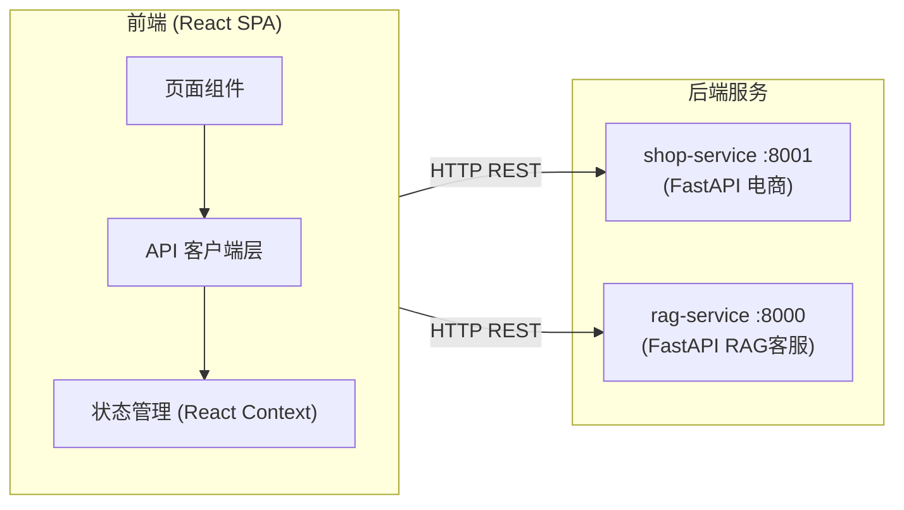

## 1. 架构设计



## 2. 技术描述

- **前端**：React 18 + TypeScript + Tailwind CSS 3 + Vite
- **初始化工具**：vite-init (react-ts 模板)
- **路由**：单页 Tab 切换，无需 react-router
- **状态管理**：React Context (用户登录态 + 购物车)
- **HTTP 客户端**：fetch (原生，零额外依赖)
- **后端**：已存在（shop-service + rag-service），无需新增

## 3. 路由/页面定义

| 页面 | 组件 | 说明 |
|------|------|------|
| 首页 (默认) | HomeTab | 热门商品 + 分类筛选 + 搜索 |
| 我的订单 | OrdersTab | 已登录可见，订单列表+详情 |
| AI客服 | AiChatTab | RAG FAQ 问答对话 |
| 商品详情 | ProductDetail (弹窗) | 大图、价格、加购 |
| 购物车 | CartDrawer (侧边栏) | 商品列表、结算 |
| 登录/注册 | AuthModal (弹窗) | 登录/注册切换 |

## 4. API 接口

| 端点 | 方法 | 用途 | 需要 Token |
|------|------|------|-----------|
| `/c-endpoint/register` | POST | 注册 | ✗ |
| `/c-endpoint/login` | POST | 登录 | ✗ |
| `/c-endpoint/me` | GET | 用户信息 | ✓ |
| `/c-endpoint/products/hot` | GET | 热门商品 | ✗ |
| `/c-endpoint/products?keyword=` | GET | 搜索 | ✗ |
| `/c-endpoint/products?category_id=` | GET | 分类浏览 | ✗ |
| `/c-endpoint/products/{id}` | GET | 商品详情 | ✗ |
| `/c-endpoint/cart/` | GET/POST/PUT/DELETE | 购物车CRUD | ✓ |
| `/c-endpoint/orders/` | GET/POST | 订单列表/创建 | ✓ |
| `/c-endpoint/orders/{id}/pay` | POST | 支付 | ✓ |
| `/c-endpoint/orders/{id}` | DELETE | 取消订单 | ✓ |
| `/c-endpoint/logistics` | GET | 物流查询 | ✓ |
| `/api/ai/chat` | POST | AI客服问答 | ✗ |

## 5. 项目结构

```
shop-frontend/
├── src/
│   ├── App.tsx              # 主入口，Tab 切换
│   ├── api.ts               # API 客户端封装
│   ├── context/
│   │   └── AuthContext.tsx   # 登录态 + Token 管理
│   ├── components/
│   │   ├── Navbar.tsx        # 顶部导航
│   │   ├── ProductCard.tsx   # 商品卡片
│   │   ├── CartDrawer.tsx    # 购物车侧边栏
│   │   ├── AuthModal.tsx     # 登录/注册弹窗
│   │   ├── ProductDetail.tsx # 商品详情弹窗
│   │   └── ChatBubble.tsx    # 聊天气泡
│   └── pages/
│       ├── HomeTab.tsx       # 首页
│       ├── OrdersTab.tsx     # 我的订单
│       └── AiChatTab.tsx     # AI客服
├── index.html
├── package.json
└── tailwind.config.js
```
